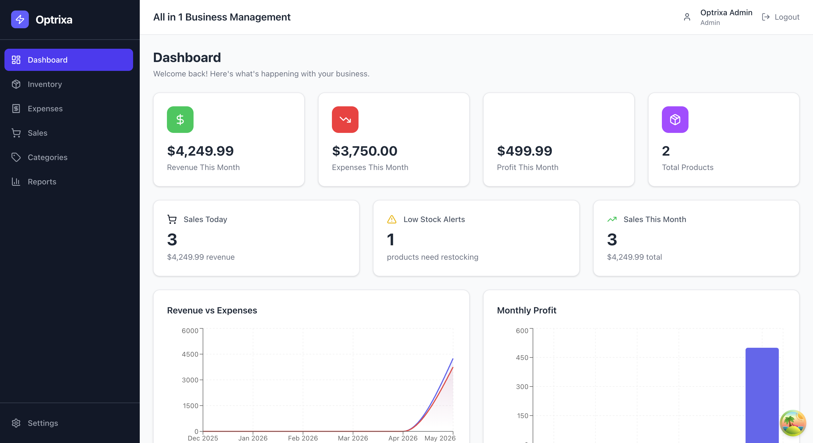
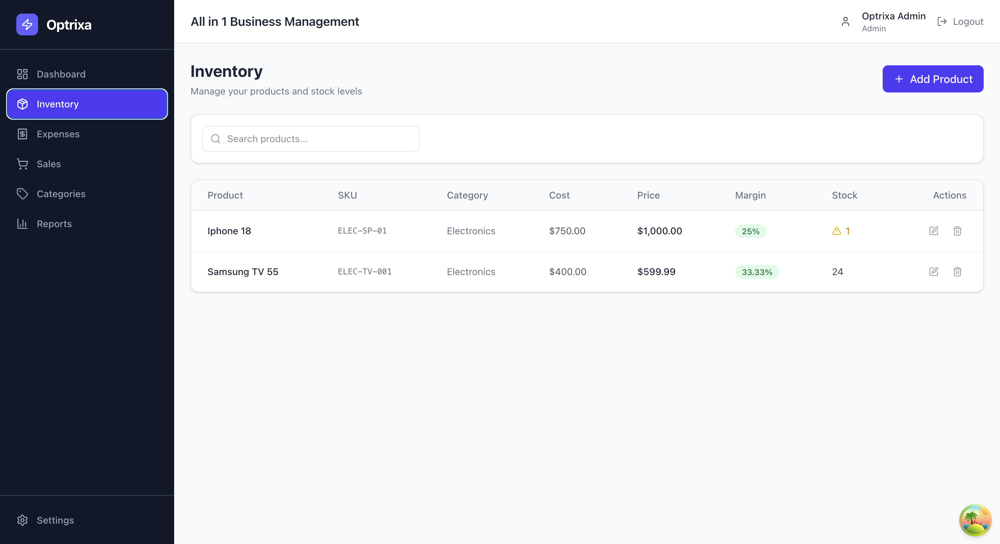
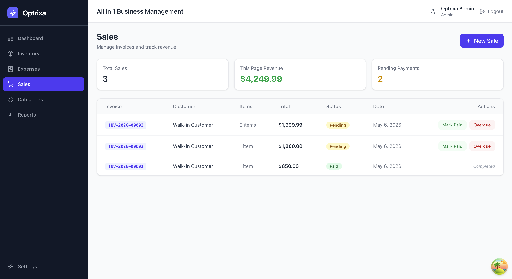
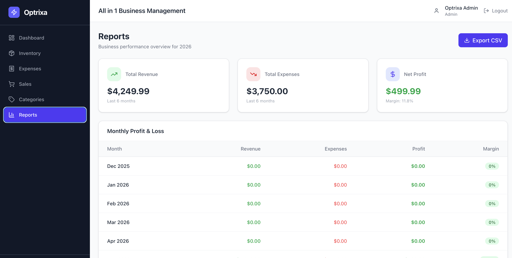

<div align="center">
  <h1>⚡ Optrixa</h1>
  <p>
    <strong>All-in-one Business Management Platform for Small & Medium Businesses</strong>
  </p>
  <p>
    
    
    
    
    
    
  </p>
</div>

---

## 📋 Overview

Optrixa is a **production-grade SaaS-style business management system** built with
Clean Architecture, combining Inventory Management, Expense Tracking, Sales Management,
and Profit/Loss Analytics in one unified platform.

---

## ✨ Features

### 🔐 Authentication & Authorization
- JWT Bearer token authentication
- Role-based access control (Admin / Employee)
- Secure password hashing via ASP.NET Identity
- Protected routes on both frontend and backend

### 📦 Inventory Management
- Add, edit, soft-delete products
- SKU code management with uniqueness validation
- Real-time stock quantity tracking
- Low stock alerts with configurable thresholds
- Supplier and category linking
- Profit margin calculation per product

### 💸 Expense Tracking
- Create and categorize business expenses
- Date-range filtering
- Monthly expense summaries
- Category management (Rent, Salaries, Utilities, etc.)

### 🛒 Sales Management
- Create sales invoices with multiple line items
- Auto-generated invoice numbers (INV-YYYY-NNNNN)
- Automatic stock decrement on sale creation
- Payment status tracking (Pending → Paid / Overdue)
- Tax and discount support
- Walk-in or linked customer sales

### 📊 Dashboard & Analytics
- Revenue, expenses, and profit — today and this month
- 6-month revenue vs expenses area chart
- Monthly profit bar chart
- Low stock alerts panel
- Real-time data via TanStack Query

### 📈 Reports
- Monthly Profit & Loss table
- CSV export
- Inventory snapshot

---

## 🏗️ Architecture

Optrixa follows **Clean Architecture** (Onion Architecture) with strict
dependency rules — inner layers never depend on outer layers.

### Design Patterns Used
- **CQRS** — Commands and Queries are fully separated
- **MediatR** — Decouples controllers from business logic
- **Repository Pattern** — Abstracts data access
- **Unit of Work** — Coordinates transactions across repositories
- **Soft Delete** — Records are never physically deleted

---

## 🛠️ Tech Stack

### Backend
| Technology | Purpose |
|---|---|
| C# 12 / .NET 8 | Primary language and runtime |
| ASP.NET Core 8 | Web API framework |
| Entity Framework Core 8 | ORM and migrations |
| SQL Server (Docker) | Primary database |
| ASP.NET Identity | User management |
| JWT Bearer | Authentication tokens |
| MediatR | CQRS mediator |
| FluentValidation | Input validation |
| AutoMapper | Object mapping |
| Serilog | Structured logging |
| Swagger / OpenAPI | API documentation |

### Frontend
| Technology | Purpose |
|---|---|
| React 18 | UI framework |
| TypeScript 5 | Type safety |
| Vite | Build tool |
| Tailwind CSS v4 | Styling |
| TanStack Query | Data fetching + caching |
| Zustand | Global state management |
| React Router v6 | Client-side routing |
| Recharts | Charts and visualizations |
| React Hook Form + Zod | Form handling + validation |
| Axios | HTTP client |
| React Hot Toast | Notifications |

### DevOps & Testing
| Technology | Purpose |
|---|---|
| Docker | SQL Server container |
| xUnit | Unit testing framework |
| Moq | Mocking framework |
| Git + GitHub | Version control |

---

## 🚀 Getting Started

### Prerequisites

- [.NET 8 SDK](https://dotnet.microsoft.com/download/dotnet/8.0)
- [Node.js 18+](https://nodejs.org/)
- [Docker Desktop](https://www.docker.com/products/docker-desktop/)
- [Git](https://git-scm.com/)

### 1. Clone the Repository

```bash
git clone https://github.com/YOUR_USERNAME/optrixa.git
cd optrixa
```

### 2. Start SQL Server (Docker)

```bash
docker run -e "ACCEPT_EULA=Y" \
  -e "MSSQL_SA_PASSWORD=Optrix@123456" \
  -p 1433:1433 \
  --name optrixa-sql \
  -d mcr.microsoft.com/mssql/server:2022-latest
```

### 3. Configure the Backend

Update `src/Optrixa.API/appsettings.json`:

```json
{
  "ConnectionStrings": {
    "DefaultConnection": "Server=localhost,1433;Database=OptrixaDb;User Id=sa;Password=Optrix@123456;TrustServerCertificate=True;"
  },
  "TokenSettings": {
    "SecretKey": "YOUR_SECRET_KEY_MIN_32_CHARACTERS_LONG",
    "Issuer": "Optrixa",
    "Audience": "OptrixaUsers",
    "ExpiryMinutes": 480
  }
}
```

### 4. Run Database Migrations

```bash
dotnet ef migrations add InitialCreate \
  --project src/Optrixa.Infrastructure \
  --startup-project src/Optrixa.API

dotnet ef database update \
  --project src/Optrixa.Infrastructure \
  --startup-project src/Optrixa.API
```

### 5. Start the Backend

```bash
dotnet run --project src/Optrixa.API
```

API runs at `http://localhost:5019`
Swagger UI at `http://localhost:5019` (root)

### 6. Start the Frontend

```bash
cd optrixa-ui
npm install
npm run dev
```

Frontend runs at `http://localhost:5173`

### 7. Default Login
Email:    admin@optrixa.com
Password: Admin@123456

---

## 🧪 Running Tests

```bash
cd tests/Optrixa.Tests
dotnet test --verbosity normal
```

**Test coverage includes:**
- Product creation with valid/invalid data
- Duplicate SKU detection
- Soft delete verification
- Sale creation with stock validation
- Insufficient stock rejection
- Stock decrement after sale
- Expense creation with user assignment

---

## 📁 Project Structure
Optrixa/
├── src/
│   ├── Optrixa.Domain/              # Entities, Interfaces, Enums
│   │   ├── Entities/
│   │   ├── Interfaces/
│   │   └── Enums/
│   ├── Optrixa.Application/         # Business Logic
│   │   ├── Features/
│   │   │   ├── Products/
│   │   │   ├── Expenses/
│   │   │   ├── Sales/
│   │   │   └── Dashboard/
│   │   ├── Common/
│   │   ├── Mappings/
│   │   └── Behaviors/
│   ├── Optrixa.Infrastructure/      # Data Access
│   │   ├── Persistence/
│   │   │   ├── Repositories/
│   │   │   └── Configurations/
│   │   └── Identity/
│   └── Optrixa.API/                 # Web API
│       ├── Controllers/
│       └── Middleware/
├── tests/
│   └── Optrixa.Tests/               # Unit Tests
├── optrixa-ui/                      # React Frontend
│   └── src/
│       ├── api/
│       ├── components/
│       ├── pages/
│       ├── store/
│       ├── types/
│       └── utils/
└── README.md

---

## 🔌 API Endpoints

| Method | Endpoint | Description | Auth |
|---|---|---|---|
| POST | `/api/Auth/login` | Login and get JWT | Public |
| GET | `/api/Products` | List products (paginated) | Required |
| POST | `/api/Products` | Create product | Admin |
| PUT | `/api/Products/{id}` | Update product | Admin |
| DELETE | `/api/Products/{id}` | Soft delete product | Admin |
| GET | `/api/Expenses` | List expenses (paginated) | Required |
| POST | `/api/Expenses` | Create expense | Required |
| GET | `/api/Sales` | List sales (paginated) | Required |
| POST | `/api/Sales` | Create sale invoice | Required |
| PATCH | `/api/Sales/{id}/status` | Update payment status | Required |
| GET | `/api/Dashboard/summary` | Analytics summary | Required |
| GET | `/api/Categories` | List categories | Required |
| POST | `/api/Categories` | Create category | Admin |

---

## 📸 Screenshots

| Dashboard | Inventory | Sales | Reports
|---|---|---|---|
|  |  |  |  |

---

## 👨‍💻 Author

**Tushar Purohit**

- GitHub: https://github.com/Tusharr1212
- LinkedIn: https://www.linkedin.com/in/tushar-purohit-55b33624a/


---

<div align="center">
  <p>Built with ❤️ using Clean Architecture + React</p>
</div>
